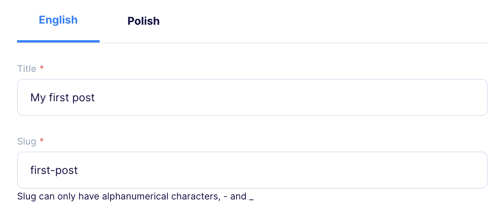
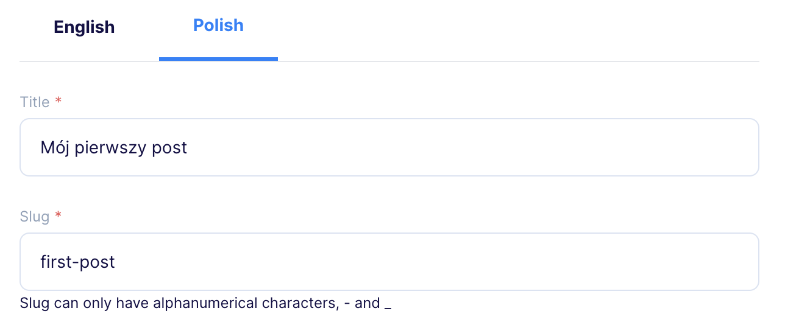

[[_TOC_]]

# Multilingual Plugin

## Overview

Multilingual Plugin is an advanced plugin that allows easy addition and management of translations while editing objects. It supports multiple languages and enables users to define and manage their own language sets.

## Configuration Steps

1. First, select the Content Types.
2. Add at least two languages and select the default language.
3. After saving the settings, the Content Types are modified and a `__translations` field is added, containing an array of available translations. The translation language is available under the `__language` field in each `__translations` item.


## Special Fields

- `__translations`: Contains an array of translations, excluding the default language, whose data is found in the object fields.
- `__language`: Specifies the translation language. Language is saved in ISO 639 language codes.

> Warning! The \_\_translations field should not be manually modified. After each change in the content type for translated fields, go to the plugin settings and save them again to properly update the translation fields.

## Plugin Usage

- When adding/editing an object, tabs with the previously selected languages will be available. The default language is always in the first tab.
- Clicking on another language tab will add the translated fields, populated with the current fields in the default language.
- If we return to the default language tab, make changes, and go back to another language tab, the previously filled fields will not be overwritten.




## Removing Content Type from plugin settings

When removing the content type from the settings, you will be asked whether to keep the translations or remove them:

- Removing: Modifies the content type, removes the `__translations` field, and deletes the collected data.
- Keeping: If you choose the "Keep translation fields" option, you can remove `__translations` field later manually by editing the content type.

## Example object

Let's assume you have an object with `title` and `slug` fields. Before applying translations, your object will look like:

```json
{
  "title": "My first blog post",
  "slug": "my-first-blog-post"
}
```

Now, let's consider that you are adding two languages: `Polish` and `English`, and your default language is `English`. After applying translations, the object will be:

```json
{
  "title": "My first blog post",
  "slug": "my-first-blog-post",
  "__translations": [
    {
      "__language": "pl",
      "title": "Mój pierwszy post na blogu",
      "slug": "my-first-blog-post"
    }
  ]
}
```

## Plugins interaction

Multilingual Plugin sends information to other plugins when a new translation has been added.
To use this information in your plugin, you need to listen to the event `flotiq-multilingual.translation::added`.

Event properties:

| Property       | Description                                                                                         |
| -------------- | --------------------------------------------------------------------------------------------------- |
| fieldName      | Translation field name with language index, eg. `__translations.[0]`                                |
| newTranslation | Full translation object                                                                             |
| contentType    | Content type that includes the field                                                                |
| initialData    | Initial data of the content object. This will be either an empty object or the object being edited. |
| language       | Language in ISO 639 language code                                                                   |

## Development

### Quick start

1. `yarn` - to install dependencies
2. `yarn start` - to start development mode - rebuild on file modifications
3. update your `plugin-manifest.json` file to contain the production URL and other plugin information
4. `yarn build` - to build plugins

### Dev environment

Dev environment is configured to use:

- `prettier` - best used with automatic format on save in IDE
- `eslint` - it is built into both `start` and `build` commands

### Output

The plugins are built into a single `dist/index.js` file. The manifest is copied to `dist/plugin-manifest.json` file.

### Deployment

<!-- TO DO -->

### Loading the plugin

**Warning:** While developing, you can use `https://localhost:3053/plugin-manifest.json` address to load the plugin manifest. Make sure your browser trusts the local certificate on the latter, to be able to use it e.g. with `https://editor.flotiq.com`

#### URL

**Hint**: You can use localhost url from development mode `https://localhost:3053/index.js`

1. Open Flotiq editor
2. Open Chrome Dev console
3. Execute the following script
   ```javascript
   FlotiqPlugins.loadPlugin("plugin-id", "<URL TO COMPILED JS>");
   ```
4. Navigate to the view that is modified by the plugin

#### Directly

1. Open Flotiq editor
2. Open Chrome Dev console
3. Paste the content of `dist/index.js`
4. Navigate to the view that is modified by the plugin

#### Deployment

**Hint**: You can use localhost url from development mode `https://localhost:3053/plugin-manifest.json`

1. Open Flotiq editor
2. Add a new plugin and paste the URL to the hosted `plugin-manifest.json` file
3. Navigate to the view that is modified by the plugin
